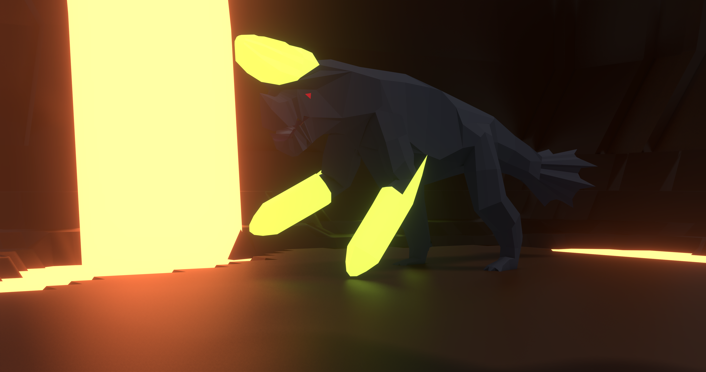
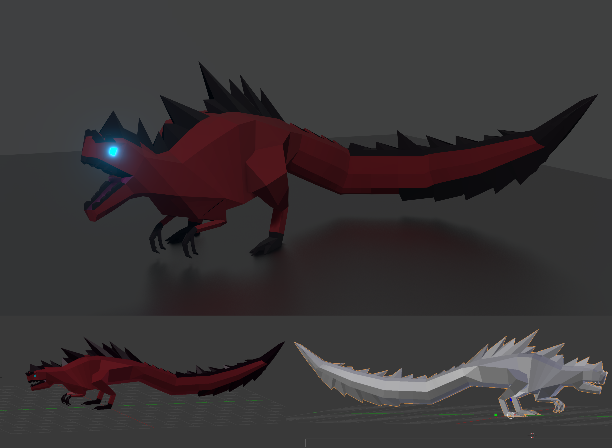
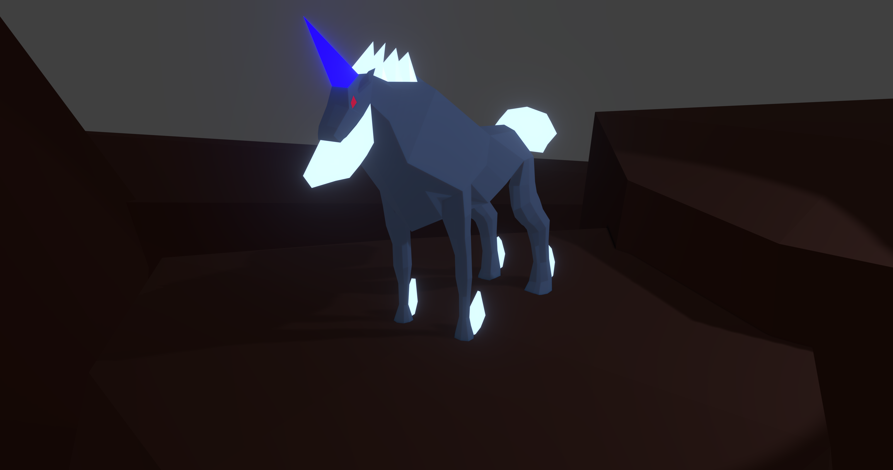

# 2019

Possibly my most active year of blender rendering so far.

# abstract spiral

The Result of some experimentation with the wireframe modifier and offset rotation. It was part of a [animation](https://www.youtube.com/watch?v=G7e9G6V8vjo) that also had a [pink variant](https://www.youtube.com/watch?v=bTWwnmA4mvY).

# brachydios

Part of my Monster Hunter fan renders. Showcases a low poly version of the monster brachydios. Maybe it has a bit to much bloom

# glavenus

Part of my Monster Hunter fan renders. Showcases a low poly version of the monster glavenus. _Firce and menacing_

# wooden hut

# kirin

Part of my Monster Hunter fan renders. Showcases a low poly version of the monster kirin. Unfortunally it never got to the quality of the other Monster Hunter fan renders.